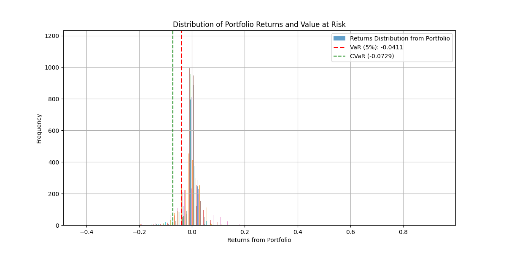
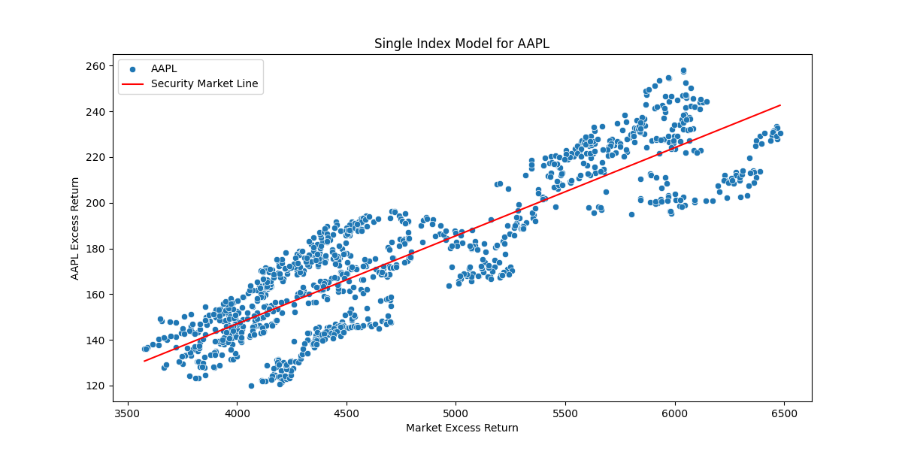
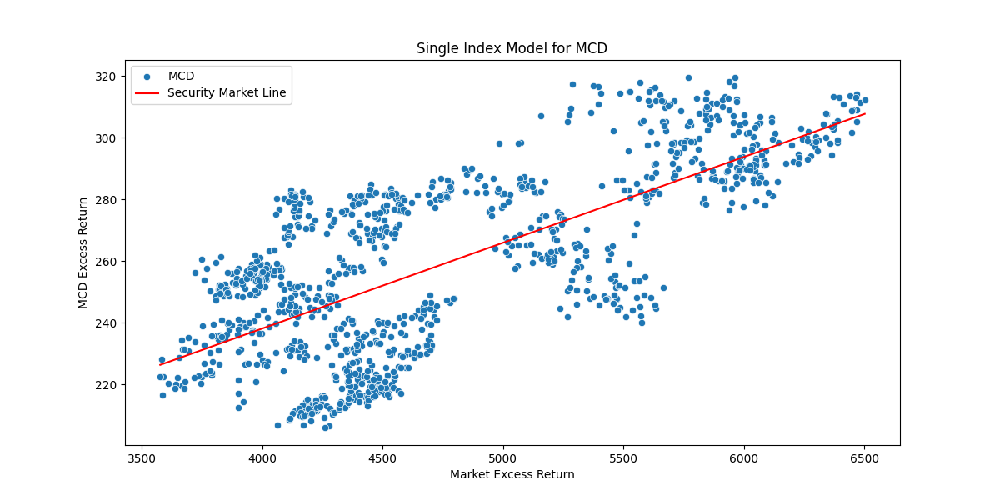
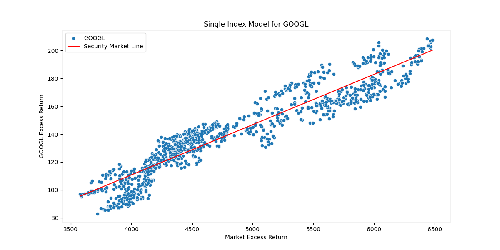

# Quant-I-Guess
A bunch of finance stuff I remember from Economics.


### Portfolio Optimization
* Go watch this video. Listen to professors, not random youtubers who lie, say nothing and make stuff up and waste time(all of them do).
* I was taught this at uni, but this man in the link is very good at explaining the Efficient Frontier and everything with EF ect..
* Link:
[efficient_diversification_video](https://www.youtube.com/watch?v=wo7LR-evnmc&t=605s)

Watch Both Parts

#### Value at Risk and Conditional Value at Risk (CVar)



Tail risk, kurtosis(greek like me!)
VaR is the maximum amount that can be lost during a certain period of time.
Expected shortfall is furter to the left compared to Value at Risk(VaR) and takes into the "tail risk" that var ignores

### Single Index Model






```text
--- Single Index Model for: GOOGL ---
Alpha (intercept): 0.000297
Beta (market sensitivity): 1.261452
R-squared: 0.4924
Residual Variance (Unsystematic Risk): 0.000194

Full regression summary:
                            OLS Regression Results                            
==============================================================================
Dep. Variable:                  GOOGL   R-squared:                       0.492
Model:                            OLS   Adj. R-squared:                  0.492
Method:                 Least Squares   F-statistic:                     1138.
Date:                Wed, 03 Sep 2025   Prob (F-statistic):          6.44e-175
Time:                        10:12:26   Log-Likelihood:                 3354.7
No. Observations:                1175   AIC:                            -6705.
Df Residuals:                    1173   BIC:                            -6695.
Df Model:                           1                                         
Covariance Type:            nonrobust                                         
==============================================================================
                 coef    std err          t      P>|t|      [0.025      0.975]
------------------------------------------------------------------------------
const          0.0003      0.000      0.731      0.465      -0.001       0.001
^GSPC          1.2615      0.037     33.732      0.000       1.188       1.335
==============================================================================
Omnibus:                      174.562   Durbin-Watson:                   1.925
Prob(Omnibus):                  0.000   Jarque-Bera (JB):             2401.373
Skew:                          -0.053   Prob(JB):                         0.00
Kurtosis:                      10.003   Cond. No.                         92.0
==============================================================================

Notes:
[1] Standard Errors assume that the covariance matrix of the errors is correctly specified.
```
All of the Single Index models have the SP500 at the independent variable and the asset(stocks in this case)
as the dependent variable. Excess returns,ect
I did not add other more CAPM related things becuase I like Markowits

#### Efficient Diversification

* This is a contrained optimization problem with the weights being the asset classes.
You cannot just have risky weight Efficient Diversifcation, you do not put all of your eggs into one basket


