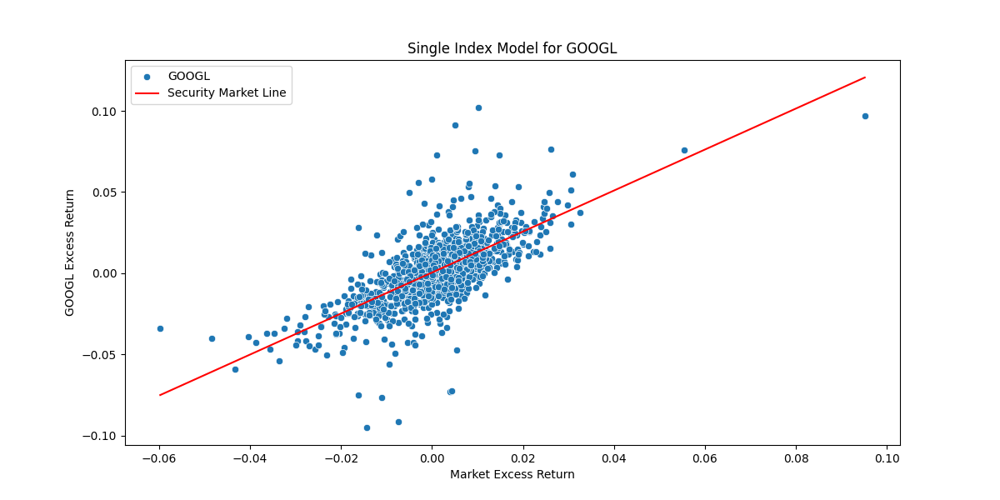

# Quant-I-Guess
A bunch of finance stuff I remember from Economics.


Watch Both Parts

#### Value at Risk and Conditional Value at Risk (CVar)


Tail risk, kurtosis(greek like me!)
VaR is the maximum amount that can be lost during a certain period of time.
Expected shortfall is furter to the left compared to Value at Risk(VaR) and takes into the "tail risk" that var ignores

### Single Index Model




```text
Market Index Risk: 0.00011708177666824404
Returns for: AAPL, Date
2020-12-24    0.007712
2020-12-28    0.035766
2020-12-29   -0.013315
2020-12-30   -0.008527
2020-12-31   -0.007702
                ...   
2025-09-15    0.011236
2025-09-16    0.006126
2025-09-17    0.003527
2025-09-18   -0.004645
2025-09-19    0.032033
Name: AAPL, Length: 1189, dtype: float64
Excess Returns: Date
2020-12-24    0.002712
2020-12-28    0.030766
2020-12-29   -0.018315
2020-12-30   -0.013527
2020-12-31   -0.012702
                ...   
2025-09-15    0.006236
2025-09-16    0.001126
2025-09-17   -0.001473
2025-09-18   -0.009645
2025-09-19    0.027033
Name: AAPL, Length: 1189, dtype: float64
Market Returns: ^GSPC,Date
2020-12-24    0.003537
2020-12-28    0.008723
2020-12-29   -0.002227
2020-12-30    0.001342
2020-12-31    0.006439
                ...   
2025-09-15    0.004707
2025-09-16   -0.001288
2025-09-17   -0.000970
2025-09-18    0.004789
2025-09-19    0.004885
Name: ^GSPC, Length: 1189, dtype: float64;----- Market Excess Returns: Date
2020-12-24    0.003537
2020-12-28    0.008723
2020-12-29   -0.002227
2020-12-30    0.001342
2020-12-31    0.006439
                ...   
2025-09-15    0.004707
2025-09-16   -0.001288
2025-09-17   -0.000970
2025-09-18    0.004789
2025-09-19    0.004885
Name: ^GSPC, Length: 1189, dtype: float64
Alpha Value: 0.0000
Beta Value: 1.2593
Adjusted Beta: 1.172854
Firm Specific Risk: 0.0001
Systematic Risk: 0.0002
Total Risk: 0.0003182716934957197
Error Term: Date
2020-12-24    0.003249
2020-12-28    0.024773
2020-12-29   -0.010519
2020-12-30   -0.010225
2020-12-31   -0.015820
                ...   
2025-09-15    0.005300
2025-09-16    0.007739
2025-09-17    0.004740
2025-09-18   -0.010684
2025-09-19    0.025872
Length: 1189, dtype: float64
ANOVA Table:                             OLS Regression Results                            
==============================================================================
Dep. Variable:                   AAPL   R-squared:                       0.583
Model:                            OLS   Adj. R-squared:                  0.583
Method:                 Least Squares   F-statistic:                     1662.
Date:                Fri, 26 Sep 2025   Prob (F-statistic):          6.45e-228
Time:                        17:05:28   Log-Likelihood:                 3620.7
No. Observations:                1189   AIC:                            -7237.
Df Residuals:                    1187   BIC:                            -7227.
Df Model:                           1                                         
Covariance Type:            nonrobust                                         
==============================================================================
                 coef    std err          t      P>|t|      [0.025      0.975]
------------------------------------------------------------------------------
const       8.981e-06      0.000      0.027      0.979      -0.001       0.001
^GSPC          1.2593      0.031     40.767      0.000       1.199       1.320
==============================================================================
Omnibus:                      108.578   Durbin-Watson:                   1.820
Prob(Omnibus):                  0.000   Jarque-Bera (JB):              636.822
Skew:                           0.143   Prob(JB):                    5.20e-139
Kurtosis:                       6.574   Cond. No.                         92.4
==============================================================================

Notes:
[1] Standard Errors assume that the covariance matrix of the errors is correctly specified.
R2 Score: 58.34
Expected Return: AAPL    0.14876
dtype: float64

```
All of the Single Index models have the SP500 at the independent variable and the asset(stocks in this case)
as the dependent variable. Excess returns,ect


