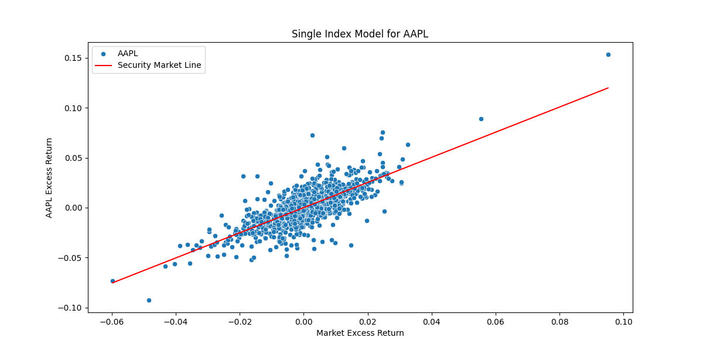

### Single Index Model, Efficient Frontier, CAPM


### Single Index Model




```text
Market Index Risk: 0.00011643582435465575
Returns for: AAPL, Date
2020-12-24    0.007712
2020-12-28    0.035766
2020-12-29   -0.013315
2020-12-30   -0.008527
2020-12-31   -0.007702
                ...   
2025-10-08    0.006160
2025-10-09   -0.015578
2025-10-10   -0.034522
2025-10-13    0.009744
2025-10-14    0.000444
Name: AAPL, Length: 1206, dtype: float64
Excess Returns: Date
2020-12-24   -0.001488
2020-12-28    0.026566
2020-12-29   -0.022515
2020-12-30   -0.017727
2020-12-31   -0.016902
                ...   
2025-10-08   -0.003040
2025-10-09   -0.024778
2025-10-10   -0.043722
2025-10-13    0.000544
2025-10-14   -0.008756
Name: AAPL, Length: 1206, dtype: float64
Market Returns: ^GSPC,Date
2020-12-24    0.003537
2020-12-28    0.008723
2020-12-29   -0.002227
2020-12-30    0.001342
2020-12-31    0.006439
                ...   
2025-10-08    0.005828
2025-10-09   -0.002756
2025-10-10   -0.027112
2025-10-13    0.015599
2025-10-14   -0.001564
Name: ^GSPC, Length: 1206, dtype: float64;-----
CAPM Returns: AAPL    0.162076
Name: mkt, dtype: float64
Alpha Value: 0.0000
Beta Value: 1.2576
Adjusted Beta: 1.171720
Firm Specific Risk: 0.0001
Systematic Risk: 0.0002
Total Risk: 0.0003170977608744517
Error Term: Date
2020-12-24    0.003243
2020-12-28    0.024775
2020-12-29   -0.010535
2020-12-30   -0.010236
2020-12-31   -0.015821
                ...   
2025-10-08   -0.001190
2025-10-09   -0.012134
2025-10-10   -0.000449
2025-10-13   -0.009894
2025-10-14    0.002390
Length: 1206, dtype: float64
ANOVA Table:                             OLS Regression Results                            
==============================================================================
Dep. Variable:                   AAPL   R-squared:                       0.581
Model:                            OLS   Adj. R-squared:                  0.580
Method:                 Least Squares   F-statistic:                     1668.
Date:                Sat, 18 Oct 2025   Prob (F-statistic):          1.69e-229
Time:                        15:25:05   Log-Likelihood:                 3670.8
No. Observations:                1206   AIC:                            -7338.
Df Residuals:                    1204   BIC:                            -7327.
Df Model:                           1                                         
Covariance Type:            nonrobust                                         
==============================================================================
                 coef    std err          t      P>|t|      [0.025      0.975]
------------------------------------------------------------------------------
const       2.158e-05      0.000      0.065      0.948      -0.001       0.001
^GSPC          1.2576      0.031     40.836      0.000       1.197       1.318
==============================================================================
Omnibus:                      111.426   Durbin-Watson:                   1.819
Prob(Omnibus):                  0.000   Jarque-Bera (JB):              642.727
Skew:                           0.171   Prob(JB):                    2.71e-140
Kurtosis:                       6.560   Cond. No.                         92.7
==============================================================================

Notes:
[1] Standard Errors assume that the covariance matrix of the errors is correctly specified.
R2 Score: 58.07
Expected Return: AAPL    0.148724

```
#### Weights from Optimized Sharpe Ratio
```
({'Expected Annual Return': np.float64(0.12895704838545163),
  'Annual Volatility': np.float64(0.06636338943010954),
  'Sharpe Ratio': np.float64(1.9431956307967433)},
 np.float64(0.12895704838545163),
 np.float64(0.06636338943010954),
 np.float64(1.9431956307967433),
 OrderedDict([('AAPL', 0.0),
              ('ARKK', 0.0),
              ('BNB-USD', 0.02105),
              ('BTC-USD', 0.0),
              ('DIA', 0.0),
              ('EFA', 0.0),
              ('ETH-USD', 0.0),
              ('F', 0.0),
              ('GM', 0.0),
              ('GOOGL', 0.01627),
              ('IWM', 0.0),
              ('LINK-USD', 0.0),
              ('MCD', 0.04289),
              ('MSFT', 0.00224),
              ('QQQ', 0.0),
              ('SBUX', 0.0),
              ('SOL-USD', 0.03761),
              ('SPY', 0.0),
              ('STETH-USD', 0.0),
              ('TGT', 0.0),
              ('TRX-USD', 0.00123),
              ('TSLA', 0.0),
              ('USDC-USD', 0.75857),
              ('USDT-USD', 0.0),
              ('VOO', 0.0),
              ('VTI', 0.0),
              ('WMT', 0.10408),
              ('XLF', 0.01604),
              ('XLK', 0.0),
              ('XRP-USD', 0.0),
              ('^GSPC', 0.0)]))
```


