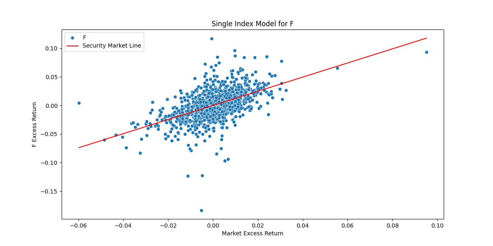
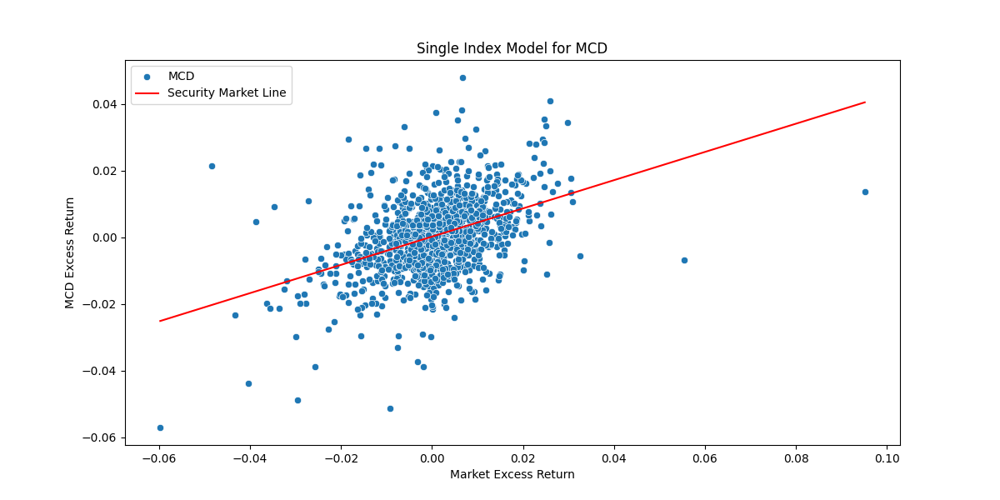

# Quant-I-Guess
A bunch of finance stuff I remember from Economics.


### Portfolio Optimization
* Go watch this video. Listen to professors, not random youtubers who lie, say nothing and make stuff up and waste time(all of them do).
* I was taught this at uni, but this man in the link is very good at explaining the Efficient Frontier and everything with EF ect..
* Link:
[efficient_diversification_video](https://www.youtube.com/watch?v=wo7LR-evnmc&t=605s)

Watch Both Parts

#### VaR Expected ShortFall


Tail risk, kurtosis(greek like me!)
VaR is the maximum amount that can be lost during a certain period of time.
Expected shortfall is furter to the left compared to Value at Risk(VaR) and takes into the "tail risk" that var ignores

### Single Index Model






```text
Single Index Model for: GOOGL
Excess Returns for Historical Stock Data: Date
2021-04-22    111.945367
2021-04-23    114.301736
2021-04-26    114.798761
2021-04-27    113.856904
2021-04-28    117.239625
                 ...    
2025-08-21    199.740800
2025-08-22    206.080796
2025-08-25    208.480805
2025-08-26    207.130799
2025-08-27    207.470796
Name: GOOGL, Length: 1093, dtype: float64
Market Excess Return: Date
2021-04-22    4134.970780
2021-04-23    4180.160722
2021-04-26    4187.610917
2021-04-27    4186.711015
2021-04-28    4183.170976
                 ...     
2025-08-21    6370.160722
2025-08-22    6466.900956
2025-08-25    6439.310624
2025-08-26    6465.930741
2025-08-27    6481.390702
Name: ^GSPC, Length: 1093, dtype: float64
Standard Deviation of Excess Returns: 28.836430641537838
                            OLS Regression Results                            
==============================================================================
Dep. Variable:                  GOOGL   R-squared:                       0.885
Model:                            OLS   Adj. R-squared:                  0.885
Method:                 Least Squares   F-statistic:                     8375.
Date:                Sat, 30 Aug 2025   Prob (F-statistic):               0.00
Time:                        14:53:48   Log-Likelihood:                -4044.4
No. Observations:                1093   AIC:                             8093.
Df Residuals:                    1091   BIC:                             8103.
Df Model:                           1                                         
Covariance Type:            nonrobust                                         
==============================================================================
                 coef    std err          t      P>|t|      [0.025      0.975]
------------------------------------------------------------------------------
const        -33.2534      1.903    -17.473      0.000     -36.988     -29.519
^GSPC          0.0360      0.000     91.513      0.000       0.035       0.037
==============================================================================
Omnibus:                       98.910   Durbin-Watson:                   0.041
Prob(Omnibus):                  0.000   Jarque-Bera (JB):               34.845
Skew:                          -0.163   Prob(JB):                     2.71e-08
Kurtosis:                       2.188   Cond. No.                     3.10e+04
==============================================================================

Notes:
[1] Standard Errors assume that the covariance matrix of the errors is correctly specified.
[2] The condition number is large, 3.1e+04. This might indicate that there are
strong multicollinearity or other numerical problems.
```
All of the Single Index models have the SP500 at the independent variable and the asset(stocks in this case)
as the dependent variable. Excess returns,ect
I did not add other more CAPM related things becuase I like Markowits

#### Efficient Diversification

* This is a contrained optimization problem with the weights being the asset classes.
You cannot just have risky weight Efficient Diversifcation, you do not put all of your eggs into one basket

There is a lot to be talked about here, and I am tired and nlp and cv and all of ml and CS in general is 1000 times
easier to me than finance. I am not a "finance guy" the transformer mechanism makes me pumped!
I do not bro out, I have bro'ed out and got mad lit with the boys, but, no, I am a geeky ml/dl lad.
Like, I want to do RAG so badly right now it is hurting. Ok. time for sleep this readme.md was cringe.


